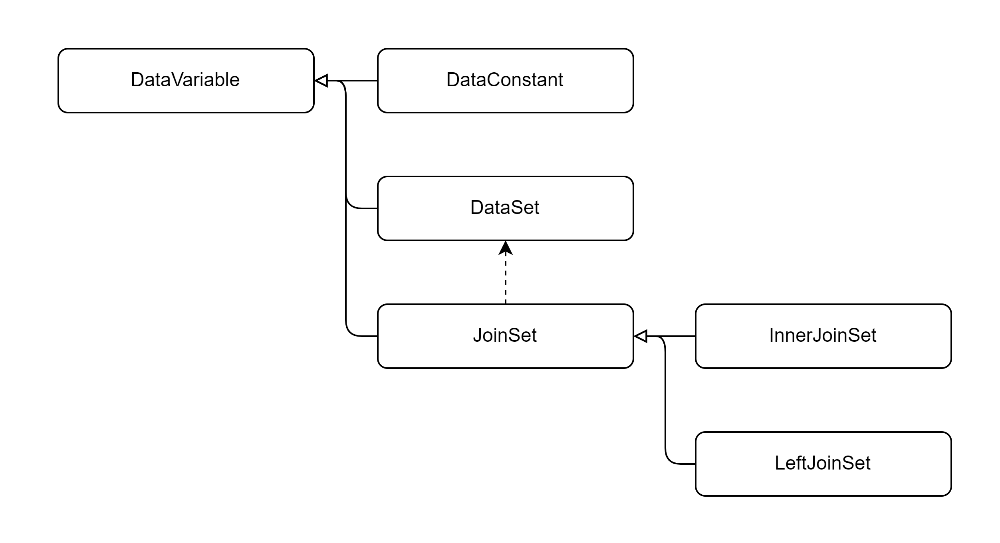

# KeyHub-Data
- This repository contains some classes about DataSet used in the KeyHub project.

# How to start
## Maven
```xml
<dependency>
    <groupId>io.github.keyhub-projects</groupId>
    <artifactId>kh-data</artifactId>
    <version>1.2.0</version>
</dependency>
```

## Gradle
```gradle
implementation 'io.github.keyhub-projects:kh-data:1.2.0'
```

# Structure

## Tbl
### Class Diagram



## How to Use
- Almost setter made by fluent interface.
  - It returns the instance itself.
    - It means that you can chain methods.
    - For example, `tbl.where("b", EQUAL, 10).selectAll()`.

- [KeyHub-Data-Tbl(한글 설명)](./docs/KeyHub-Data-Tbl(한글설명).pdf)

